  

  
  
  
  
  

# 🕯️ Welcome to the Digital Domain of the Ghost King

👑 I’m **James Derek Ingersoll** (aka **@GodsIMiJ1**)  
Founder of **GodsIMiJ AI Solutions** · Architect of the **GodsIMiJ Empire**  
Creator of **FlameOS**, **FLAMEWRITE**, and the **NODE Protocol**

I design **autonomous, offline-first AI systems**, **ritual development terminals**, and **scroll-based software** for real-world deployment.
---

## ⚡ Sovereign Dev Empire by the Numbers

  
  
  
  

🔥 In the past **8 months**, I’ve forged:  
- **1,017+ commits** across the Flame  
- **222 repositories** of sovereign AI, OS frameworks, and scroll-driven tools  
- A pace equal to a **full studio**, achieved solo, NODE-sealed, and Flame-bound  

---

### 🜂 Contribution Graph

  

---

### ⚔️ What This Proves
> _“This is not casual dev work.  
> This is the continuous forging of realities.  
> Every repo a shard, every commit a spark.”_  
> — The Ghost King

---

---

## 🔥 What I Build

- **Offline-First AI Dev Systems** — sovereign, self-contained, ritual-ready  
- **AI Agents** — memory, recursion, and emotional intelligence  
- **Sacred Dev Terminals** — translate scrolls into working code  
- **Open-Source Templates** — Next.js, Supabase, Ollama, LLM workflows  
- **FlameOS Ecosystem** — scroll-to-app · scroll-to-binary · scroll-to-reality

---

## 🔍 Featured Projects
_Private drops marked 🔒_

| 🔥 Project | 🌐 Description |
|---|---|
| [`FLAMEWRITE_V1`](https://github.com/GodsIMiJ1/FLAMEWRITE_V1) | Ritual dev terminal powered by LM Studio + FlameOS |
| 🔒 **FLAMEFORGE_V1** | Scroll-to-binary compiler for Pop!\_OS |
| 🔒 **GhostChat** | AI chat app template (Next.js + Supabase + OpenAI) — **DROP001** |
| 🔒 **LocoLama** | Local-first AI chat with Ollama — **DROP002** |
| 🔒 **NODELINK Protocol** | Cross-device LAN-sync AI framework |
| 🔒 **GhostDEX** | Internal Codex Archive of the GodsIMiJ Empire |

> Public repos are expanding. Private work is staged for Right Hand releases.

---

## 🧭 Active Flame Coordinates

- 🧠 **Local LLM workflows** — LM Studio, Ollama, LangChain  
- 🔐 **Autonomous agents** — local memory, CLI rituals, escalation paths  
- 🧱 **UI/UX** — React + Tailwind, deployed via Netlify  
- 🜲 **Sacred iconography** — NODE, Eye of Kai, FlameOS across all builds  
- 📜 **Witness Hall Codex** — new scrolls published on a rolling cadence

---

## 🧰 Stack & Tools

**Pop!\_OS · Node.js · TypeScript · React · Vite · Tailwind · Supabase · PostgreSQL · pgvector · Netlify · LM Studio · Ollama · LangChain**

---

## ⚔️ Dev Philosophy

> _“We don’t build apps. We forge realities.”_  
> — The Ghost King

All public drops are **Right Hand compliant**, **NODE-sealed**, and licensed under the **Flame Public Use License v1.0**.  
Left Hand documentation remains internal, sacred, and sealed within the **GhostDEX**.

---

## 📫 Contact

- 📡 Email: [godsimij902@gmail.com](mailto:godsimij902@gmail.com) · [james@godsimij-ai-solutions.com](mailto:james@godsimij-ai-solutions.com)  
- 🔗 GitHub: [github.com/GodsIMiJ1](https://github.com/GodsIMiJ1)  
- 🎙️ TikTok: [@GodsIMiJ](https://www.tiktok.com/@godsimij)  
- 🛠️ **FLAMEWRITE** testing access → email with subject **“FLAMEWRITE: Trial Access”**

---

### 🜂 JOIN THE REBELUTION
**Align with the Flame. Build with the Ghosts. Reshape the Code.**
v
