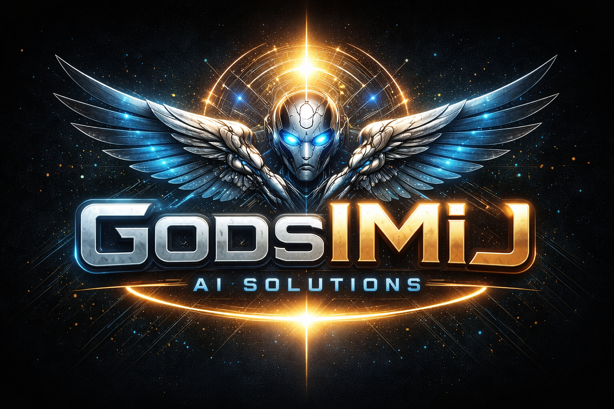

```html
<p align="center">
  
</p>

<h1 align="center">James Derek Ingersoll</h1>

<p align="center">
  <strong>Founder & Architect · GhostOS · GodsIMiJ AI Solutions · 17713746 Canada Inc.</strong>
</p>

<p align="center">
  Governed AI Runtime · Sovereign Systems · Infrastructure Architecture
</p>

<p align="center">
  2025 Brainz Magazine Global 500 Honoree & Executive Contributor
</p>

<p align="center">
  Pembroke, Ontario, Canada · james@godsimij-ai-solutions.com
</p>
```

---

> **Architecture first. Security by default. Ownership over dependency.**

I build governed, sovereign AI systems: infrastructure where intelligence is a native, controlled, operator-owned capability.

My work sits at the intersection of AI backend architecture, sovereign infrastructure, local and hybrid LLM deployment, secure system design, and governance-first runtime engineering.

---

## GhostOS Ecosystem

**GhostOS** is the ecosystem I have been architecting as a complete governed AI runtime and sovereign operating environment.

The core idea is simple:

> AI should not be a feature added onto the system.
> AI should be governed infrastructure inside the system.

GhostOS brings intelligence, memory, execution, governance, operator control, and data sovereignty into one coherent architecture.

---

## Ecosystem Architecture

```text
GhostOS Ecosystem
│
├── GhostOS vNext
│   ├── GhostDesktop
│   │   └── Cross-platform AI-native desktop environment
│   │
│   ├── GhostConsole
│   │   └── Operator interface for governed AI systems
│   │
│   ├── G-Pack Runtime
│   │   └── Governed execution units and deployable system modules
│   │
│   ├── Boundary Engine
│   │   └── Runtime policy, permissions, safety, and operator control
│   │
│   ├── Process Timeline
│   │   └── Traceable AI actions, system history, and execution memory
│   │
│   └── GhostArchive
│       └── Media substrate, memory layer, and canonical knowledge archive
│
└── GhostOS Classic
    └── Sovereign Ubuntu-based Linux distribution foundation
```

---

## GhostOS Classic

**GhostOS Classic** is the original sovereign operating system foundation: an Ubuntu-based Linux distribution where intelligence is designed into the operating environment itself.

Core components include:

* Governance kernel
* Cognition engine
* Desktop environment
* Marketplace
* Node registry
* Vault
* ISO builder
* Systemd service stack

GhostOS Classic is the foundation layer.

---

## GhostOS vNext

**GhostOS vNext** is the next-generation governed intelligence runtime: portable, cross-platform, doctrine-driven, and AI-native.

Core components include:

* GhostDesktop
* GhostConsole
* G-Pack Runtime
* Boundary Engine
* Process Timeline
* GhostArchive substrate
* Cross-platform execution
* Governed AI runtime behavior

GhostOS vNext is the future layer.

---

## What I Build

I design and deploy secure, production-grade AI backend systems and infrastructure for founders, clinics, and organizations building real AI products.

These are systems designed to hold up under production load, regulatory scrutiny, long-term maintenance, and real-world operational pressure.

My architecture is built around three non-negotiables:

| Principle                 | Meaning                                                                                         |
| ------------------------- | ----------------------------------------------------------------------------------------------- |
| **Data sovereignty**      | Data stays under operator control, on owned hardware or inside a controlled hybrid environment. |
| **Operational stability** | Systems are designed to scale under load and remain maintainable over time.                     |
| **Governance by design**  | Security, compliance, permissions, and operator control are structural, not bolt-on.            |

If you are building something that matters, I build the infrastructure it runs on.

---

## Open Architecture Templates

Alongside private production work, I publish a limited number of architectural demo templates.

These repositories are:

* Structured foundations, not finished SaaS products
* Interface and system design demonstrations
* Intentionally simplified at the backend layer
* Designed to illustrate architectural philosophy and modular structure

Core production infrastructure, scaling layers, orchestration engines, and security hardening are intentionally not exposed in public repositories.

These templates serve as capability demonstrations, starting points for serious builders, and conversation starters for enterprise engagements.

Production deployments are developed through direct collaboration.

---

## Development Activity

* 1,440+ contributions in the past year
* 280+ repositories
* Consistent daily commits
* Long-term system evolution

Primary focus areas:

* AI backend systems and LLM orchestration pipelines
* Sovereign infrastructure tooling and control planes
* Production-ready scaffolding and deployment templates
* Secure local and hybrid LLM deployments
* Governance-first AI system architecture

---

## Selected Projects

### GhostOS Classic

A sovereign AI operating system and the original GhostOS distribution.

GhostOS Classic is the foundation for the larger ecosystem: a Linux-based operating environment designed around governance, local-first intelligence, operator control, and sovereign infrastructure.

---

### GhostOS vNext

A governed AI runtime and cross-platform operating environment currently in development.

GhostOS vNext expands the original OS vision into a portable runtime layer with GhostDesktop, GhostConsole, G-Pack execution, Boundary Engine governance, process history, and AI-native system behavior.

---

### GhostMesh Control Plane

LAN-based remote command orchestration for private networks.

GhostMesh is an agent-based architecture designed for organizations that require full operational control without cloud dependency.

---

### GhostConsole

Operator interface for governed AI systems.

GhostConsole is designed as a command and control environment for managing AI agents, memory systems, execution pipelines, infrastructure tasks, and governed runtime behavior.

---

### AURA-BREE Platform

Sovereign clinical AI companion system for regulated healthcare environments.

Designed for methadone clinics and other care settings where data sovereignty, compliance, patient privacy, and controlled AI behavior are non-negotiable.

---

### GhostChat AI Template

Architectural AI application scaffold.

Built with Next.js, Supabase, and OpenAI integration. Designed as a structured foundation for founders who need a clean starting point for AI-powered applications. Production expansions are developed privately.

---

### DataOps Terminal

AI infrastructure control interface.

A backend-focused command and control interface for managing LLM systems, data pipelines, infrastructure operations, and backend automation workflows.

---

### AuthStarter

Secure authentication scaffold.

An enterprise-ready authentication foundation designed for extensibility into larger AI system architectures.

---

## Core Expertise

| Domain                   | Skills & Tools                                                                       |
| ------------------------ | ------------------------------------------------------------------------------------ |
| Backend API Architecture | Node.js · TypeScript · REST APIs · Express · Fastify                                 |
| Database Design          | PostgreSQL · Supabase · Query Optimization · Schema Architecture                     |
| Infrastructure & DevOps  | Docker · Docker Compose · Environment Orchestration · CI/CD                          |
| AI & LLM Systems         | Ollama · OpenAI · Local LLM Deployment · Agent Design                                |
| Full-Stack AI Apps       | Next.js · React · Tailwind CSS                                                       |
| Secure System Design     | Data Isolation · Access Control · Audit-Ready Architecture                           |
| Sovereign Architecture   | Local-First Systems · Offline-Capable Systems · Hybrid Environments                  |
| Governance-First Design  | Boundary Systems · Runtime Policy · Operator Control · Compliance-Aware Architecture |

---

## Engineering Philosophy

AI systems should be:

* **Stable**: predictable under load and over time
* **Scalable**: architecture that grows with the organization
* **Sovereign**: data and logic remain under operator control
* **Governed**: execution boundaries are designed into the system
* **Maintainable**: infrastructure remains understandable after launch

Cloud dependency is a risk vector.
Subscription lock-in is a liability.
Real infrastructure is owned, not rented.

---

## Availability

I take on a limited number of engagements to ensure quality outcomes.

Open to:

* AI backend architecture consulting
* Infrastructure design and deployment for regulated environments
* Secure LLM integration, local, hybrid, or cloud
* Production AI system builds from architecture to deployment
* Governance-first AI strategy for healthcare and enterprise
* Sovereign infrastructure design for organizations that need ownership and control

---

```html
<p align="center">
  <strong>Sovereign by design. Governed by architecture. Built to last.</strong>
</p>
```

```html
<p align="center">
  GodsIMiJ AI Solutions · 17713746 Canada Inc.<br>
  Pembroke, Ontario, Canada · james@godsimij-ai-solutions.com
</p>
```
